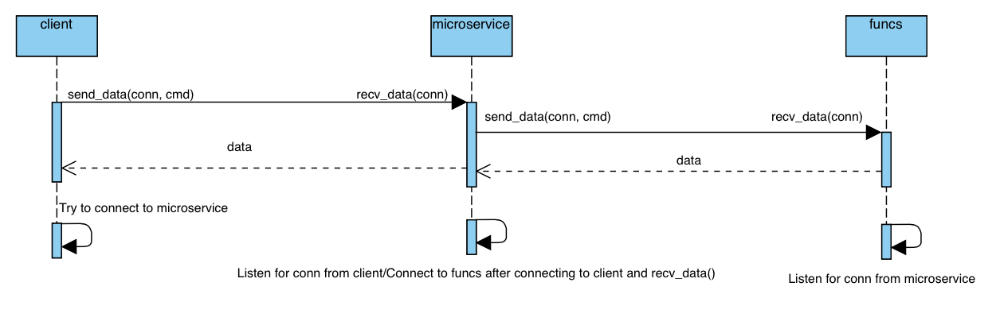

# Microservice for Brandon Healey's Individual Project

This folder contains the microservice written by Cameron Rice for Brandon Healey's individual project.

Please note the following:
* Run microservice.py and then client.py and funcs.py.
* The result variable "res" referenced throughout the code is the result of the function call to the microservice.
  * This will be dependent on the function called for. So, it can be treated as a variable with one value, or a payload
* FPORT is the port that funcs.py listens on. MPORT is the port that microservice.py listens on.
  * client.py connects to microservice.py on MPORT and microservice.py connects to funcs.py on FPORT

Data is requested by the client.py file asking the user for a command. Then that is sent to the microservice.py file which then sends it to the funcs.py file. The funcs.py file then sends the data back to the microservice.py file which then sends it back to the client.py file.
* The use of send_data is used to send the requested command over the socket
* send_data(conn, command) for example

Data is received by the client.py file automatically due to how the sockets are set up. The microservice automatically handles the data received from the funcs.py file and sends it back to the client.py file.
* The use of recv_data() is used to receive the data from the socket
* recv_data(conn) for example

All of this is possible through using python sockets as a communication medium.

